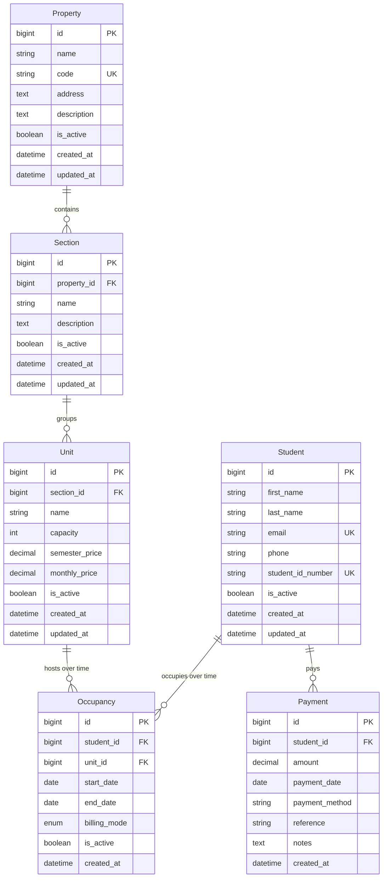

# Database Architecture

## Overview

KarosL is a multi-property accommodation management platform. The database is designed to support multiple properties, student occupancy tracking with full movement history, flexible billing, and payment recording — all while keeping balances as derived calculations rather than stored values.

---

## Business Rules

1. Students choose an available unit before registering.
2. Students may move between units.
3. Movement history is never lost.
4. Payments belong to students, not to occupancy periods.
5. Balances are always calculated, never stored.
6. Units can be renamed without affecting historical data.
7. A property can contain any number of sections.
8. A section can contain any number of units.
9. A unit has a fixed capacity (e.g. 2 or 3 occupants).
10. Units have both a semester price and a monthly price.
11. Students may pay in full or in partial installments.
12. The system must support multiple properties and multiple users in the future.

---

## Entity Definitions

### 1. `Property`

| Attribute | Detail |
|---|---|
| **Purpose** | A physical managed location (building, complex, campus). Enables future multi-property operation. |
| **Primary Key** | `id` — `BIGINT` auto-increment |
| **Fields** | `name`, `code` (unique short slug), `address`, `description`, `is_active`, `created_at`, `updated_at` |
| **Constraints** | `code` UNIQUE; `name` NOT NULL |

### 2. `Section`

| Attribute | Detail |
|---|---|
| **Purpose** | A logical grouping within a Property (e.g. "Block A", "North Wing", "Floor 2"). Decouples unit organization from physical layout so regrouping never requires data migration. |
| **Primary Key** | `id` — `BIGINT` auto-increment |
| **Foreign Key** | `property_id` → `Property.id` (ON DELETE RESTRICT) |
| **Fields** | `name`, `description`, `is_active`, `created_at`, `updated_at` |
| **Constraints** | UNIQUE(`property_id`, `name`) |

### 3. `Unit`

| Attribute | Detail |
|---|---|
| **Purpose** | An individual rentable accommodation (room, apartment, dorm bed-space). Holds pricing and capacity. |
| **Primary Key** | `id` — `BIGINT` auto-increment |
| **Foreign Key** | `section_id` → `Section.id` (ON DELETE RESTRICT) |
| **Fields** | `name`, `capacity` (positive integer), `semester_price` (Decimal), `monthly_price` (Decimal), `is_active`, `created_at`, `updated_at` |
| **Constraints** | UNIQUE(`section_id`, `name`); `capacity` ≥ 1; both prices > 0 |

> **Mutable names are safe**: Occupancy records reference `unit_id`, never the name string. Renaming a unit has zero effect on historical data.

### 4. `Student`

| Attribute | Detail |
|---|---|
| **Purpose** | A person who occupies units. Separate from the system `User` model because a person may be a student without ever logging in, and a system user (admin, accountant) may not be a student. A future FK from `User` → `Student` enables multi-user auth. |
| **Primary Key** | `id` — `BIGINT` auto-increment |
| **Fields** | `first_name`, `last_name`, `email`, `phone`, `student_id_number` (external ID), `is_active`, `created_at`, `updated_at` |
| **Constraints** | `email` UNIQUE; `student_id_number` UNIQUE; name fields NOT NULL |

### 5. `Occupancy`

| Attribute | Detail |
|---|---|
| **Purpose** | The core temporal link between a Student and a Unit. Every move creates a new row; old rows are never modified (only `end_date` is set). This guarantees full movement history. |
| **Primary Key** | `id` — `BIGINT` auto-increment |
| **Foreign Keys** | `student_id` → `Student.id` (ON DELETE RESTRICT); `unit_id` → `Unit.id` (ON DELETE RESTRICT) |
| **Fields** | `start_date` (date, NOT NULL), `end_date` (date, nullable — NULL = currently active), `billing_mode` (enum: `'semester'` or `'monthly'`), `is_active`, `created_at` |
| **Constraints** | `end_date` > `start_date` when set; at most one Occupancy per student with `end_date IS NULL` (enforced via partial unique index) |

> **Why `billing_mode` lives on Occupancy**: The student chooses their plan at move-in time. Storing it on the Occupancy ties the choice to the period it governs, so historical records remain self-consistent even if the unit's prices or the student's plan later change.

### 6. `Payment`

| Attribute | Detail |
|---|---|
| **Purpose** | Every financial transaction a student makes. Supports partial payments and multiple payments per billing period. |
| **Primary Key** | `id` — `BIGINT` auto-increment |
| **Foreign Key** | `student_id` → `Student.id` (ON DELETE RESTRICT) |
| **Fields** | `amount` (Decimal, > 0), `payment_date` (date), `payment_method` (varchar: e.g. `'cash'`, `'transfer'`, `'card'`), `reference` (external transaction ID, nullable), `notes`, `created_at` |
| **Constraints** | `amount` > 0 |

> **Why `student_id` and not `occupancy_id`**: A single payment may cover multiple occupancy periods. Tying payments to the student directly keeps the payment ledger clean and independent of occupancy changes.

---

## Entity Relationships

### Relationship Diagram (Mermaid ER)



### Relationship Descriptions

| Relationship | Type | Why |
|---|---|---|
| **Property → Section** | One-to-Many | A property is a physical place; sections are internal divisions. Query all sections for a property to render its tree. RESTRICT prevents accidental cascading deletes. |
| **Section → Unit** | One-to-Many | Sections organize units. The same section name can exist in different properties (unique constraint is scoped to `property_id`). Units are the leaf nodes of the location tree. |
| **Student → Occupancy** | One-to-Many | A student moves over time. Each move appends a row. A partial unique index on `(student_id) WHERE end_date IS NULL` enforces "a student is in exactly one unit right now" without sacrificing history. |
| **Unit → Occupancy** | One-to-Many | A unit houses different students sequentially. Query `SELECT * FROM occupancy WHERE unit_id = X AND end_date IS NULL` to find current occupants. Count them and compare to `capacity` to determine availability. |
| **Student → Payment** | One-to-Many | A student makes multiple payments (installments, multiple periods). Summing payments per student is a straightforward aggregate. |

---

## Balance Calculation

Balances are derived, never stored.

```
balance = SUM(charges) - SUM(payments)

For each Occupancy where end_date >= calculation_period_start:
    IF billing_mode = 'semester':
        charge = Unit.semester_price
    ELSE:  -- monthly
        months = CEIL( (COALESCE(end_date, TODAY) - start_date) / 30.0 )
        charge = Unit.monthly_price * months
```

---

## Candidate Indexes

| Table | Index | Rationale |
|---|---|---|
| `Property` | `code` (unique) | Lookup by slug |
| `Section` | `(property_id, name)` | Unique constraint + tree traversal |
| `Unit` | `(section_id, name)` | Unique constraint |
| `Unit` | `(capacity)` | Find available units by capacity |
| `Unit` | `(is_active)` | Filter only rentable units |
| `Student` | `email` | Login / lookup |
| `Student` | `student_id_number` | External reference |
| `Student` | `(last_name, first_name)` | Search |
| `Occupancy` | `(student_id, end_date)` | **Partial index** `WHERE end_date IS NULL` — enforce one active occupancy per student |
| `Occupancy` | `(unit_id, end_date)` | **Partial index** `WHERE end_date IS NULL` — count current occupants of a unit |
| `Occupancy` | `(start_date)` | History range queries |
| `Payment` | `(student_id, payment_date)` | Balance calculation (most recent payments first) |
| `Payment` | `payment_date` | Period reporting / reconciliation |

---

## Design Decisions

| Decision | Rationale |
|---|---|
| Separate `Student` from `User` | A person may be a student without logging in; an admin may never be a student. Keeps auth concerns independent of domain data. |
| Temporal Occupancy model | Every move creates a new row. `end_date IS NULL` marks the active period. Guarantees audit trail without triggers or soft-delete hacks. |
| Payments keyed to Student, not Occupancy | A single payment can cover multiple occupancy periods (e.g. a semester payment that spans a move). Student-keyed payments are simpler and more flexible. |
| Prices stored on Unit | Simplicity for MVP. See scalability concern #1 below for the planned `UnitPriceHistory` table. |
| `billing_mode` on Occupancy | The choice is tied to the period it governs. If a student switches plans, the old occupancy is closed and a new one starts — history remains self-consistent. |
| `ON DELETE RESTRICT` on all FKs | Prevents accidental data loss. Decommissioning entities requires an explicit deactivation workflow, not a cascading delete. |

---

## Future Scalability Concerns

### 1. Price Changes Mid-Period

Current prices live on `Unit`. If a price changes during an active occupancy, charge recalculation uses the new price, which may be incorrect for the period before the change.

**Mitigation**: Add a `UnitPriceHistory` table (`unit_id`, `semester_price`, `monthly_price`, `effective_from`, `effective_to`) before going to production. The balance formula then joins against this table instead of `Unit` directly.

### 2. Occupancy Table Growth

Every move creates a new row. With thousands of students moving every semester, this table grows linearly.

**Mitigation**: Partition on `start_date` by year. Archive rows where both `end_date` and `start_date` are older than N years to a cold-storage table.

### 3. Payment Table Growth

Also unbounded. Same partitioning and archival strategy as Occupancy.

### 4. Balance Calculation Performance

Scanning every occupancy and every payment for a student who has been in the system for 4+ years is expensive.

**Mitigation**: (a) Cache the computed balance with a TTL, (b) introduce a materialized view refreshed daily, or (c) use window functions instead of row-by-row iteration.

### 5. Multi-Tenant Isolation

All properties currently share the same tables. When one property grows to 50K units, queries for another small property may suffer.

**Long-term options**: (a) Add `property_id` to `Student`, `Occupancy`, and `Payment` for partition pruning / row-level security, (b) physically separate databases per tenant, (c) use Postgres schemas per tenant.

### 6. Soft-Delete Sprawl

The `is_active` pattern on Property, Section, Unit, and Student adds a hidden filtering cost to every query. Every `JOIN` needs `WHERE is_active = true` or results are wrong.

**Mitigation**: Use Postgres partial indexes per active status. Consider hard-deleting with an archive job after a grace period.

### 7. Billing Mode Granularity

Currently per-Occupancy. If a student switches from monthly to semester mid-occupancy, they need two occupancy rows (close one, open another). This creates a "fake move."

**Mitigation**: Accept the fake move — it is a small price for a clean temporal model. The occupancy history correctly reflects the period each billing mode applied.
